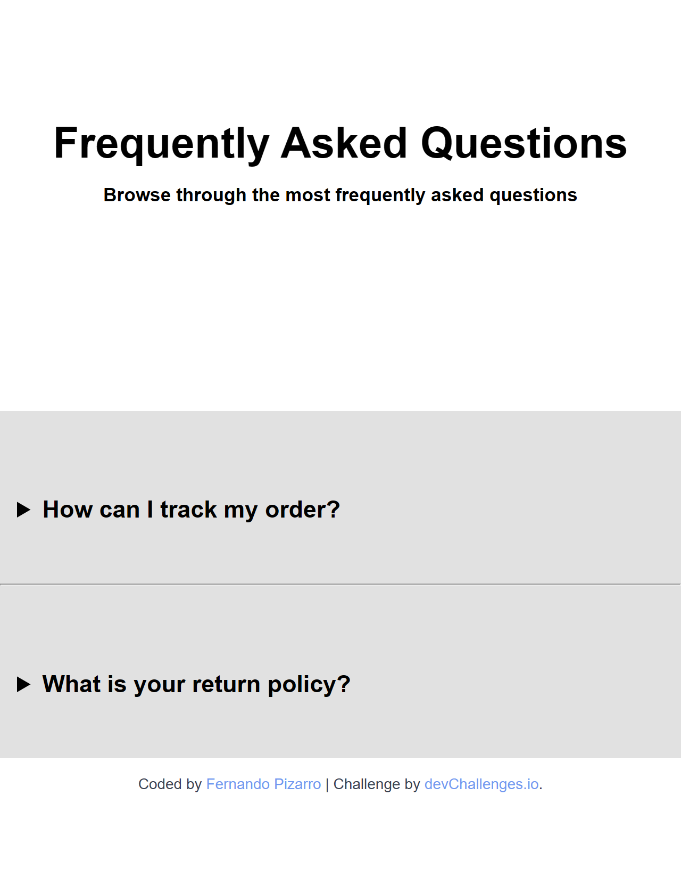
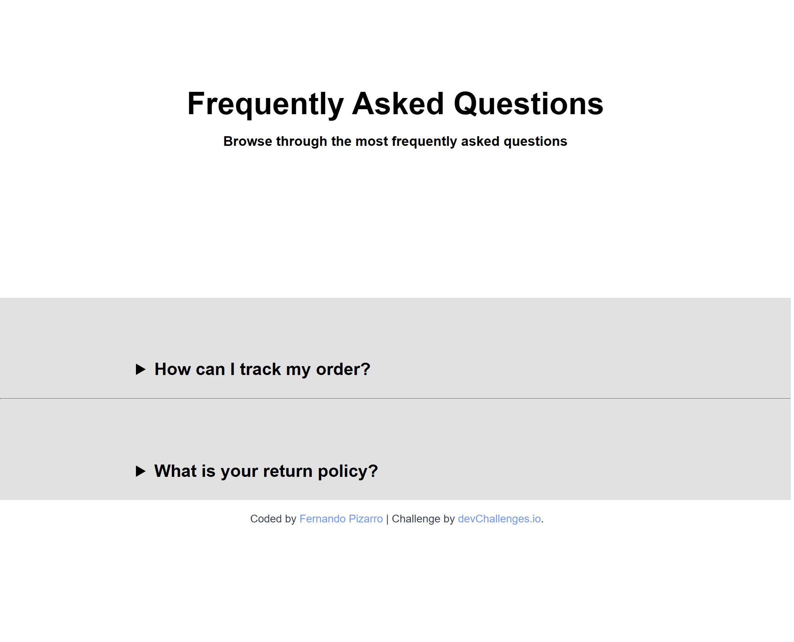
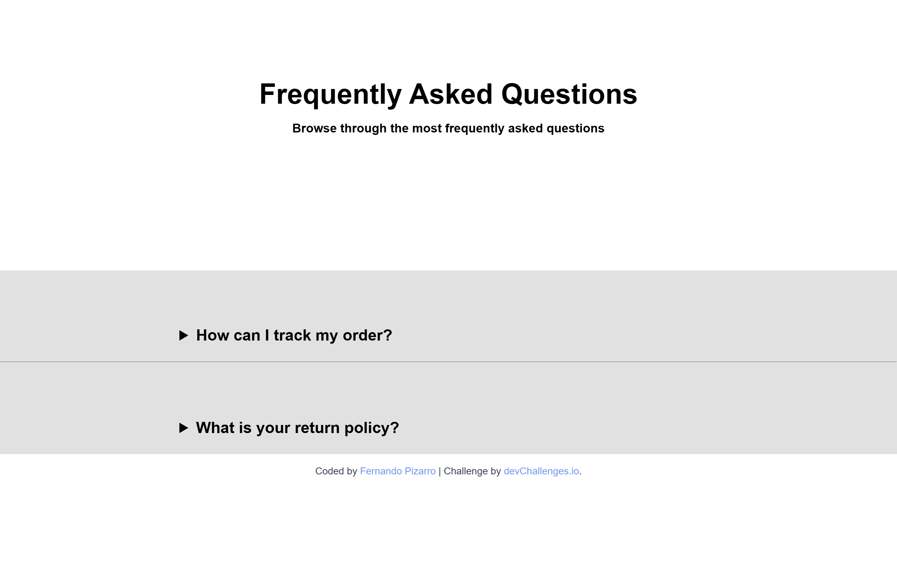

# Simple FAQ Page ― DevChallenges

This is my solution to the **Simple FAQ** coding challenge on [DevChallenges.io](https://devchallenges.io/).  
The goal was to build a fully-responsive, accessible FAQ component using only **HTML & CSS**.

---

## 🚀 Live Demo

| Version | URL |
|---------|-----|
| **Demo** | https://fernandopizarrodw.github.io/devchallenges-faq/ |
| **Repo** | https://github.com/fernandopizarrodw/devchallenges-faq |

---

## 📸 Screenshots

| Mobile (≤ 640 px) | Desktop (≥ 1280 px) |
|-------------------|---------------------|
|  |   |

---

## ⚙️ Built With

- **Semantic HTML5** (`
 / 
` for native toggles)
- **CSS3** ― mobile-first, custom properties & media queries
- **Pseudo-elements** for full-width background stretch
- **BEM-style class names** for clarity and reusability

---

## 🧠 What I Learned

1. Creating accessible collapsible sections without JavaScript.
2. Using `::before` + `position: absolute` + `width: 100vw` to let backgrounds span the viewport while text stays in a centered container.
3. Fine-tuning breakpoints (1024 px & 1280 px) to maintain readable line-lengths across devices.

---

## 🗂️ Folder Structure

## Author

- GitHub – [@fernandopizarrodw](https://github.com/fernandopizarrodw)
- Frontend Mentor – [@fernandopizarrodw](https://www.frontendmentor.io/profile/fernandopizarrodw)
- LinkedIn – [Fernando Pizarro](https://www.linkedin.com/in/fernandopizarro-dev/)

## 🎯 Challenge by

[DevChallenges.io](https://devchallenges.io/)